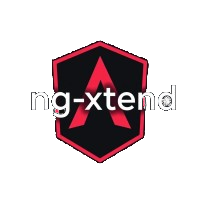
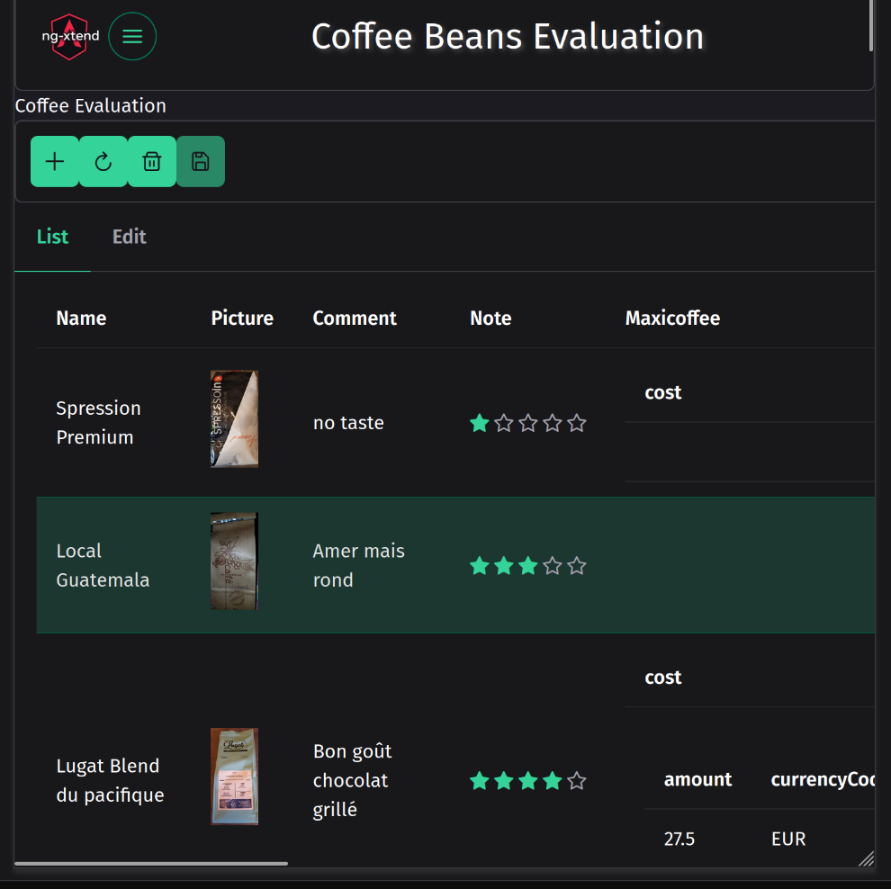
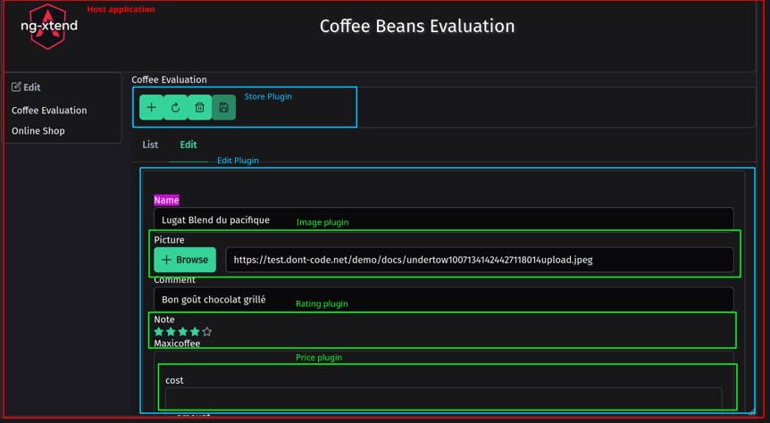

#  ng-xtend Framework

> **Empower your Angular applications with a flexible, scalable plugin ecosystem!** 🚀

[](https://test.dont-code.net/apps/latest/xt-host/?project=Coffee%20Beans%20Evaluation)
[](LICENSE)

## 💡 Why ng-xtend?

The most successful web platforms—like WordPress, Nextcloud, or Drupal—thrive because of their massive plugin ecosystems. They make it effortless to extend functionality without touching the core.

In the Angular & TypeScript world, achieving this level of modularity has always been a challenge. **ng-xtend was built to bridge that gap.** It allows you to build "extensible by design" applications where external teams can contribute features seamlessly.

## ✨ Key Features

ng-xtend is an Angular library that enables you to:

*   🧩 **Define once, render anywhere:** Focus on your data structures; let plugins handle the UI.
*   ⚡ **Dynamic Loading:** Load and install plugins at runtime—no rebuild required.
*   💾 **Storage Agnostic:** Save, load, and update data to any backend or storage.
*   🔌 **Seamless Interop:** Plugins work together intelligently, even without knowing each other exists.

---

## 📸 See it in Action

### ☕ Coffee Bean Evaluation
A real-world example of an app handling complex data (lists, views, and editions) entirely through dynamic plugins.

[](https://test.dont-code.net/apps/latest/xt-host/?project=Coffee%20Beans%20Evaluation)

### 🛠️ Plugin Tester
Curious about how plugins are dynamically injected? Try the dedicated tester:

[](https://test.dont-code.net/apps/latest/plugin-tester)

---

## 🛠️ Supported Plugin Types

Currently, ng-xtend supports four major extension points:

| Type | Description |
| :--- | :--- |
| **Simple Components** | Turn regular Angular components into pluggable units for specific data types. |
| **Complex Components** | Components that provide their own extension points. *Example: A "Money" plugin delegating "Currency" selection to another plugin.* |
| **List Components** | Effortlessly display collections of objects by delegating item rendering to the right plugins. |
| **Action Handlers** ✨ | Add logic and actionable buttons to your UI dynamically. |

---

## 🚀 How it Works (The Magic)

The host application doesn't need to know its plugins at compile time. It simply sets **Render Points (`xt-render`)**:

1.  **Configuration:** A simple JSON file defines which plugins to load from which remote URLs.
2.  **Registration:** Upon loading, the plugin registers itself and declares which data types or actions it supports.
3.  **Resolution:** When ng-xtend encounters a specific type (e.g., `Rating`, `Currency`), it automatically finds and injects the correct component from the loaded plugins.

---

## 🗺️ Roadmap

- [x] Dynamic insertion of simple components
- [x] Plugin registry system
- [x] Support for complex components and lists
- [x] Strong type support
- [x] Remote dynamic loading
- [x] Action components support
- [ ] **v1.0 Release!** 🏁
- [ ] Enhanced component selection (context-aware)
- [ ] v2.0 & beyond

---

## 🧑‍💻 Getting Started

### Developing a Plugin
We use a monorepo structure powered by [Rush](https://rushjs.io/).
```bash
npm install -g @microsoft/rush
rush update
rush build
```

## ng-xtend, what for?

The most successful web applications enjoy an eco-system of plugins with them. Check Nextcloud, Drupal, Joomla! or Wordpress, it's so easy to extend them with a plugin that meets your needs.

The technology they are using, PHP, makes it easy to develop and install new plugins. With limited efforts, these plugins are automatically installed, recognized and available.

While I love the way Angular & Typescript work, there is no easy way to provide extension capabilities through plugins developed by external teams.

That's why I have developed ng-xtend !

## What is ng-xtend concretely?

It's an Angular library allowing you to:

- Define in a simple way the data you want to process in your application.
- Use plugins together to render or edit this data.
- Dynamically load and install plugins.
- Save / Load / Update the data to any storage.

## News
- ***2025-11-02:*** Added support for actions, allowing plugins to add features dynamically, and added the agenda plugin, with support for recurrent tasks
- ***2025-09-06:*** Version 0.5, moved to Angular 20.2, added country selection plugin.
- ***2025-08-24:*** Published of apps developed: [Dashboard](https://dont-code.net/apps/repo/default)
- ***2025-07-14:*** First release, with support for dynamic plugins (thanks to [Angular architects!](https://github.com/angular-architects/module-federation-plugin)) and a few plugins for Financial, Web and International applications. As well, added a default plugin to edit any data.

## Try it !
A simple application to rate coffee beans:

[](https://test.dont-code.net/apps/latest/xt-host/?project=Coffee%20Beans%20Evaluation){target="_blank"}

Test how plugins are dynamically loaded:

[](https://test.dont-code.net/apps/latest/plugin-tester){target="_blank"}

## Some examples ?
Here are screenshots of an application automatically handling list, view and edition of complex data (evaluations of coffee beans) using ng-xtend, a [dont-code application](https://dont-code.net/){target="_blank"}, and the [default plugin](https://github.com/dont-code/ng-xtend/tree/main/plugins/xt-default) and [web plugin](https://github.com/dont-code/ng-xtend/tree/main/plugins/xt-web)  
You can see how the different plugins work together without knowing each other. Even the host application does not know them.




Curious ? You can run and test the application here:
[Coffee Bean Evaluation](https://test.dont-code.net/apps/latest/xt-host/?project=Coffee%20Beans%20Evaluation){target="_blank"}

## What kind of plugins are supported ?

3 types of plugins are supported as a first step
 
- Simple Components: With limited effort and intrusion in your code, you can transform a regular Angular component into a pluggable one. Ideal for providing view or display of a custom type.
- Complex Components: With some additional effort, this type Angular Component can itself provide extension points, filled by ng-xtend with the right plugin. Ideal for displaying complex information, where you want to delegate actions or display.
For example, think of a "Money" plugin that delegates the "Currency" management to another plugin, without even knowing it.
- List Components: Displays a list of any objects. It calls other plugins to manage the values inside the displayed list
- Action Handlers: New ! Provides actionable services on types without User Interface elements.

Then in the future, we'll support

- Workflow components: Enable pre-defined flow of pages (list to detail for example...) 

## How does it work ?

As you can infer from the preceding descriptions, the ng-xtend framework heavily relies on types. Any data manipulated in a ng-xtendable application manipulates data with a type.

As mentioned, a plugin can be used to display or edit a certain type in the UI, or to act on the type. The actions will be displayed as buttons the user can click.

The host application dynamically loads the plugins from remote locations. A [simple config file is enough](https://github.com/dont-code/ng-xtend/blob/main/apps/xt-host/projects/host/public/assets/config/default.json) to define what plugins to load from where.

Upon loading, the plugin registers itself to ng-xtend and provides the list of types and actions it supports.

Whenever encountering a certain type, ng-xtend will look for the right plugin, select the right component, and call it with the proper context. This happens without the host knowing the plugin.

The host only needs to provide xt-render points in their application, like "here you can display action buttons for this 'type'", or "here I need the user to enter this 'type', please find the right plugin".

As well, plugins will be able to alter the application menus and other customizations.

## What is the roadmap ?

- [x] Insertion of simple component dynamically 
- [x] Registry of plugins
- [x] General support for complex components and lists
- [x] Strong type support
- [x] Dynamic loading of plugins
- [x] Support for action components
- [ ] v1 !
- [ ] Enhanced component selection criteria (xt-type, context)
- [ ] v2 !

## How to use it ?
This is still work in progress, but now it can support [real-life applications](https://test.dont-code.net/apps/latest/xt-host/?project=Coffee%20Beans%20Evaluation){target="_blank"} !

### Developing a new plugin
1. Checkout the repository [ng-xtend](https://github.com/dont-code/ng-xtend){target="_blank"}
2. It's a monorepo using [rush build system](https://rushjs.io/), so run

```bash
    npm install -g @microsoft/rush
    rush update
    rush build
```

3. Use a copy of [libs/xt-plugin-sample](https://github.com/dont-code/ng-xtend/tree/main/libs/xt-plugin-sample) to develop your own plugins and components.
3. Unit test your components using vitest
   - ng-xtend provides pre-defined test pages for different cases (in a form or not) that will easily embed your component for testing
   - See [currency simple component test](https://github.com/dont-code/ng-xtend/blob/main/libs/xt-plugin-sample/projects/sample/src/lib/currency/sample-currency.component.spec.ts){target="_blank"}
   - Or [money complex component test](https://github.com/dont-code/ng-xtend/blob/main/libs/xt-plugin-sample/projects/sample/src/lib/money/sample-money.component.spec.ts){target="_blank"}
   
4. Test your components using plugin-tester
   - More details in plugin-tester [user documentation](apps/xt-plugin-tester/README.md).
   - Run your plugin tester application, for example `ng serve sample-tester` for the sample plugin
   - Run the xt-plugin-tester with `ng serve plugin-tester` in xt-plugin-tester directory
   - In the Plugin Tester app, load your plugin by entering its url (http://localhost:4201 for sample plugin) in the Plugin url field.
   - Once loaded, go to the test screen, select your component in the second screen, and play with it
   - For easier debugging, you can statically add and register your plugin to [xt-plugin-tester/package.json](https://github.com/dont-code/ng-xtend/blob/main/apps/xt-plugin-tester/package.json){target="_blank"}

### Use plugins in my application
To use ng-xtend plugins in your own Angular Application,
[xt-host project](apps/xt-host/README.md) is a great example.
It does:

  - Install xt-components and the default plugin in your package.json

```bash
    npm install xt-components xt-type xt-store
    npm install xt-plugin-default
```

  - Configure your application to load your plugins.

```javascript
    protected resolverService = inject (XtResolverService);
    this.resolverService.loadPlugin(url);
```

    The plugins will register themselves automatically.
  - Describe the data type you want to manipulate

```javascript
    this.resolverService.registerTypes ({
      money:{
        amount:'number',
      currency:'currency'  /** Type provided by the finance plugin **/ 
    },
      book: {
        name:'string',
        publication:'date',
        price:'money',
        notation:'rating'  /** Type provided by the web plugin **/
      }    
    }); 
```

   - Sets insertion point in your angular pages
     - For example, to display a table of books

```html
        <h1>List of books</h1>
        <xt-render [displayMode]="LIST_VIEW" [valueType]="book" [value]="listOfBooks" ></xt-render>
```

     - or allow editing a book information

```html
        <h1>Enter your book details</h1>
        <div form="bookForm">
          <xt-render [displayMode]="FULL_EDITABLE" [valueType]="book" [formGroup]="bookForm" subName="book"></xt-render>
        </div>
```
     - To support more complex scenario, use

```html
       <xt-render-sub [context]="context()"></xt-render-sub>
```

    with `context ()` returning type information necessary to select the right component.

## Thank you
Please check my other project [Dont-code](https://dont-code.net){target="_blank"}, it will soon run using ng-xtend !
Email: contact@ng-xtend.dev or developer@dont-code.net
