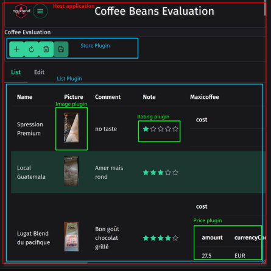

#  ng-xtend Framework

> **Empower your Angular applications with a flexible, scalable plugin ecosystem!** 🚀

[](https://test.dont-code.net/apps/latest/host/?project=Coffee%20Beans%20Evaluation)
[](LICENSE)

## 💡 Why ng-xtend?

The most successful web platforms —like WordPress, Nextcloud, or Drupal— thrive because of their massive plugin ecosystems. They make it effortless to extend functionality without touching the core.

In the Angular & TypeScript world, achieving this level of modularity has always been a challenge. **ng-xtend was built to bridge that gap.** It allows you to build "extensible by design" applications where external teams can contribute features seamlessly.

## ✨ Key Features

ng-xtend is an Angular library that enables you to:

*   🧩 **Define once, render anywhere:** Focus on your data structures; let the plugins handle the UI.
*   ⚡ **Dynamic Loading:** Load and install plugins at runtime—no rebuild required.
*   💾 **Storage Agnostic:** Save, load, and update data to any backend or storage.
*   🔌 **Seamless Interop:** Plugins work together intelligently, even without knowing each others.

---

## 📸 See it in Action

### ☕ Coffee Bean Evaluation
A real-world example of an app handling complex data (lists, views, and editions) entirely through dynamic plugins.

[](https://test.dont-code.net/apps/latest/host/?project=Coffee%20Beans%20Evaluation)

### Other Demos

Demo applications can be seen here:

[](https://dont-code.net/apps/repo/default/)

---

## News
- ***2026-01-27:*** Added repository with multiple examples of ng-xtend usage. => [ng-xtend-examples](https://github.com/dont-code/ng-xtend-examples)
- ***2026-01-04:*** Version 0.5.5, supports for many to one references
- ***2025-11-02:*** Added support for actions, allowing plugins to add features dynamically, and added the agenda plugin, with support for recurrent tasks
- ***2025-09-06:*** Version 0.5, moved to Angular 20.2, added country selection plugin.
- ***2025-08-24:*** Published of apps developed: [Dashboard](https://dont-code.net/apps/repo/default)
- ***2025-07-14:*** First release, with support for dynamic plugins (thanks to [Angular architects!](https://github.com/angular-architects/module-federation-plugin)) and a few plugins for Financial, Web and International applications. As well, added a default plugin to edit any data.


## 🚀 How it Works (The Magic)

The host application doesn't need to know its plugins at compile time. It simply sets **Render Points (`xt-render`)**:

1.  **Configuration:** A simple JSON file defines which plugins to load from which remote URLs.
2.  **Registration:** Upon loading, the plugin registers itself and declares which data types or actions it supports.
3.  **Resolution:** When ng-xtend encounters a specific type (e.g., `Rating`, `Currency`), it automatically finds and injects the correct component from the loaded plugins.

---

## 🛠️ Supported Plugin Types

Currently, ng-xtend supports four major extension points:

| Type | Description |
| :--- | :--- |
| **Simple Components** | Turn regular Angular components into pluggable units for specific data types. |
| **Complex Components** | Components that provide their own extension points. *Example: A "Money" plugin delegating "Currency" selection to another plugin.* |
| **List Components** | Effortlessly display collections of objects by delegating item rendering to the right plugins. |
| **Action Handlers** ✨ | Add logic and actionable buttons to your UI dynamically. |

---

## Some examples ?
Here are screenshots of an application automatically handling list, view and edition of complex data (evaluations of coffee beans) using ng-xtend, a [dont-code application](https://dont-code.net/){target="_blank"}, and the [default plugin](https://github.com/dont-code/ng-xtend/tree/main/plugins/xt-default) and [web plugin](https://github.com/dont-code/ng-xtend/tree/main/plugins/xt-web)  
You can see how the different plugins work together without knowing each other. Even the host application does not know them.




### 🛠️ Plugin Tester
Curious about how plugins are dynamically injected? Try the dedicated tester:

[](https://test.dont-code.net/apps/latest/plugin-tester)

---

## 🗺️ Roadmap

- [x] Dynamic insertion of simple components
- [x] Plugin registry system
- [x] Support for complex components and lists
- [x] Strong type support
- [x] Remote dynamic loading
- [x] Action components support
- [ ] Workflows
- [ ] Enhanced modelization support
- [ ] **v1.0 Release!** 🏁
- [ ] AI application generation
- [ ] Enhanced plugin isolation
- [ ] v2.0 & beyond

---

## 🧑‍💻 Getting Started
### Using the Framework
The repository [ng-xtend-examples](https://github.com/dont-code/ng-xtend-examples) shows many examples (from basic to complex) using ng-xtend.
You should have a look at it to get started.

### ️Repository of examples
To better understand the real-world usage of ng-xtend, we've developed a set of example projects, in the [ng-xtend examples](https://github.com/dont-code/ng-xtend-examples) repository.

Here is a short description of each one:

| Example                                                                          | Description                                                                                                                                                                   |
|----------------------------------------------------------------------------------|-------------------------------------------------------------------------------------------------------------------------------------------------------------------------------|
| [basic-example](https://github.com/dont-code/ng-xtend-examples/tree/main/basic)  | Displays any object in various format in a generic way                                                                                                                        |
| [typed-example](https://github.com/dont-code/ng-xtend-examples/tree/main/typed)  | By describing the type handled, ng-xtend supports more use cases                                                                                                              |
| [plugin-example](https://github.com/dont-code/ng-xtend-examples/tree/main/plugin) | Countries and Money fields looks nicer thanks to the newly added plugins. They are discovered and used transparently by the ng-xtend framework                                |
| [inout-example](https://github.com/dont-code/ng-xtend-examples/tree/main/inout)  | A full list / edit / view flow is setup thanks to inputs / outputs connecting unknown components together.                                                                    |
| [store-example](https://github.com/dont-code/ng-xtend-examples/tree/main/store)  | Edited elements are persisted between sessions thanks to the xt-store library included with the ng-xtend framework.                                                           |
| [advanced-type-example](https://github.com/dont-code/ng-xtend-examples/tree/main/advanced-type)                                           | Showcase support for advanced types and models (like references)                                                                                                              |
| [dynamic-example](https://github.com/dont-code/ng-xtend-examples/tree/main/dynamic)                                                       | Loads all plugins dynamically from another website using [Native-Federation](https://github.com/angular-architects/module-federation-plugin/tree/main/libs/native-federation)|

---

### Developing a Plugin
We use a monorepo structure powered by [Rush](https://rushjs.io/).
```bash
npm install -g @microsoft/rush
rush update
rush build
```


## Detailed plugin development guide
1. Checkout the repository [ng-xtend](https://github.com/dont-code/ng-xtend){target="_blank"}
2. It's a monorepo using [rush build system](https://rushjs.io/), so run

```bash
    npm install -g @microsoft/rush
    rush update
    rush build
```

3. Use a copy of [libs/xt-plugin-sample](https://github.com/dont-code/ng-xtend/tree/main/libs/xt-plugin-sample) to develop your own plugins and components.
3. Unit test your components using vitest
   - ng-xtend provides pre-defined test pages for different cases (in a form or not) that will easily embed your component for testing
   - See [currency simple component test](https://github.com/dont-code/ng-xtend/blob/main/libs/xt-plugin-sample/projects/sample/src/lib/currency/sample-currency.component.spec.ts){target="_blank"}
   - Or [money complex component test](https://github.com/dont-code/ng-xtend/blob/main/libs/xt-plugin-sample/projects/sample/src/lib/money/sample-money.component.spec.ts){target="_blank"}
   
4. Test your components using plugin-tester
   - More details in plugin-tester [user documentation](apps/xt-plugin-tester/README.md).
   - Run your plugin tester application, for example `ng serve sample-tester` for the sample plugin
   - Run the xt-plugin-tester with `ng serve plugin-tester` in xt-plugin-tester directory
   - In the Plugin Tester app, load your plugin by entering its url (http://localhost:4201 for sample plugin) in the Plugin url field.
   - Once loaded, go to the test screen, select your component in the second screen, and play with it
   - For easier debugging, you can statically add and register your plugin to [xt-plugin-tester/package.json](https://github.com/dont-code/ng-xtend/blob/main/apps/xt-plugin-tester/package.json){target="_blank"}

### Use plugins in my application
To use ng-xtend plugins in your own Angular Application,
[xt-host project](apps/xt-host/README.md) is a great example.
It does:

  - Install xt-components and the default plugin in your package.json

```bash
    npm install xt-components xt-type xt-store
    npm install xt-plugin-default
```

  - Configure your application to load your plugins.

```javascript
    protected resolverService = inject (XtResolverService);
    this.resolverService.loadPlugin(url);
```

    The plugins will register themselves automatically.
  - Describe the data type you want to manipulate

```javascript
    this.resolverService.registerTypes ({
      money:{
        amount:'number',
      currency:'currency'  /** Type provided by the finance plugin **/ 
    },
      book: {
        name:'string',
        publication:'date',
        price:'money',
        notation:'rating'  /** Type provided by the web plugin **/
      }    
    }); 
```

   - Sets insertion point in your angular pages
     - For example, to display a table of books

```html
        <h1>List of books</h1>
        <xt-render [displayMode]="LIST_VIEW" [valueType]="book" [value]="listOfBooks" ></xt-render>
```

     - or allow editing a book information

```html
        <h1>Enter your book details</h1>
        <div form="bookForm">
          <xt-render [displayMode]="FULL_EDITABLE" [valueType]="book" [formGroup]="bookForm" subName="book"></xt-render>
        </div>
```
     - To support more complex scenario, use

```html
       <xt-render-sub [context]="context()"></xt-render-sub>
```

    with `context ()` returning type information necessary to select the right component.

## Thank you
Please check my other project [Dont-code](https://dont-code.net){target="_blank"}, it will soon run using ng-xtend !
Email: contact@ng-xtend.dev or developer@dont-code.net
