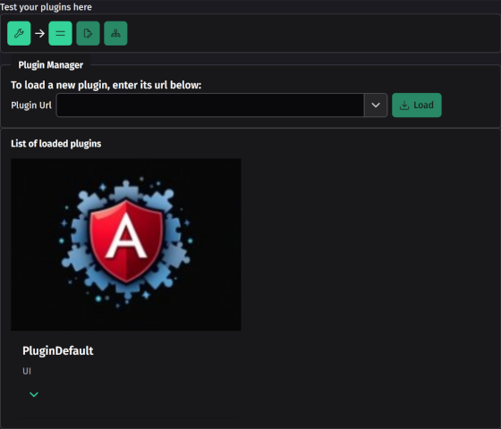
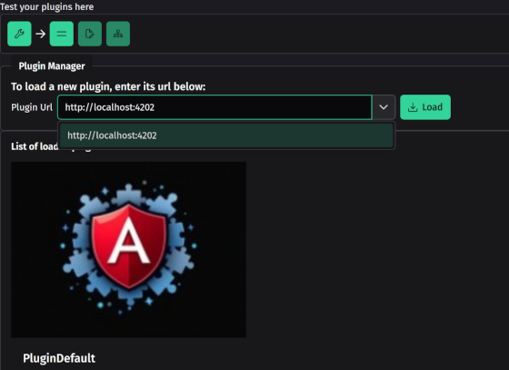
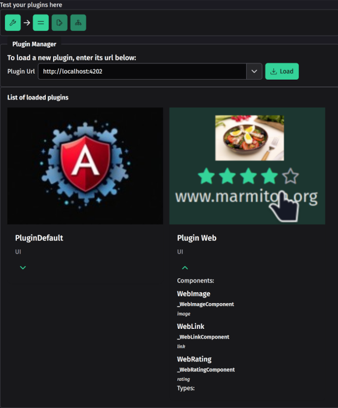
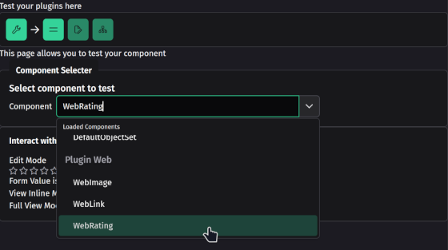
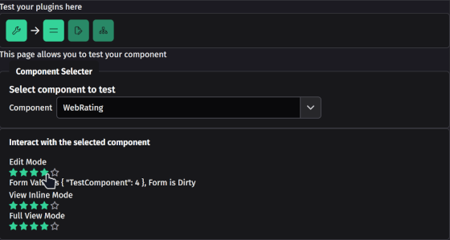

# Plugin Tester

This project allows you to load and test in live your developed components for the [ng-xtend framework](https://github.com/dont-code/ng-xtend/blob/main/README.md)

Test your components by
1. Building the xt-components framework
```bash
    npm install -g @microsoft/rush
    rush update
    rush build
```
4. Starting your plugin, for example, the web-plugin
```bash
  cd ../plugins/xt-web
  ng serve web-tester
```
3. Then running the xt-plugin-tester with `ng serve plugin-tester`



6. Typing the plugin url in the url bar:



7. Then pressing load button will execute the plugin



8. Go to the test page, and selects your component to test



9. the component is then run in editing and viewing mode, allowing you to test!




