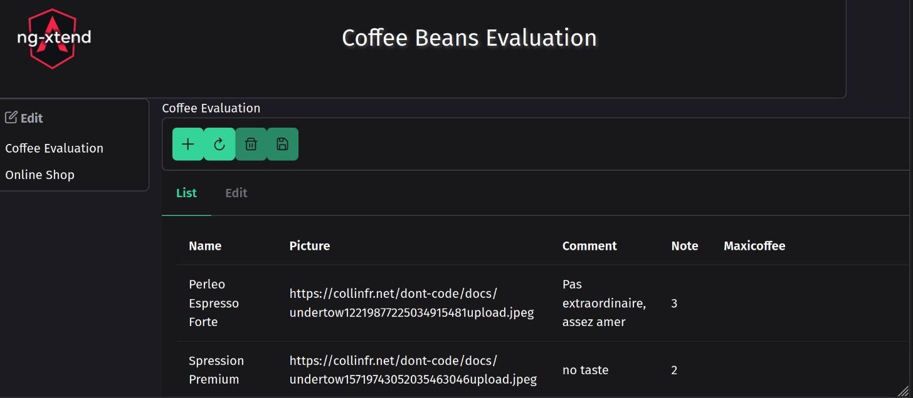
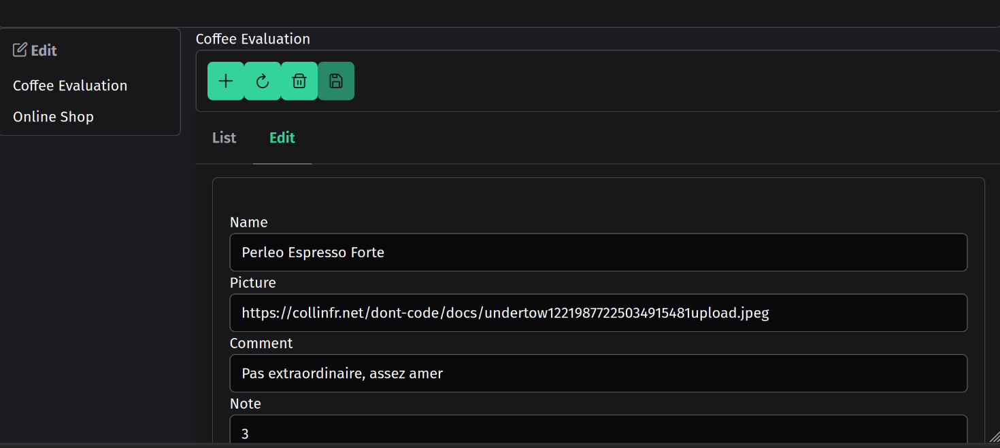

# xt-host

A host to run your application developed using [Dont-code framework](https://dont-code.net)
It can load Dont-code repository files, get the Dont-code services url, loads the plugins, loads the project and allow you to edit the application.
This is a replacement of the Dont-code Previewer.

To test it:
1. Run the xt-host application with `ng serve xt-host`
2. Go to [localhost:4200](http://localhost:4200)
3. and see it automatically load and execute the "Coffee Beans Evaluation" application.

4. You can execute another Dont-code application by adding its name in the url: [BBQ Sauce tasting] (http://localhost:4200/?project=BBQ%20Sauce%20tasting)
