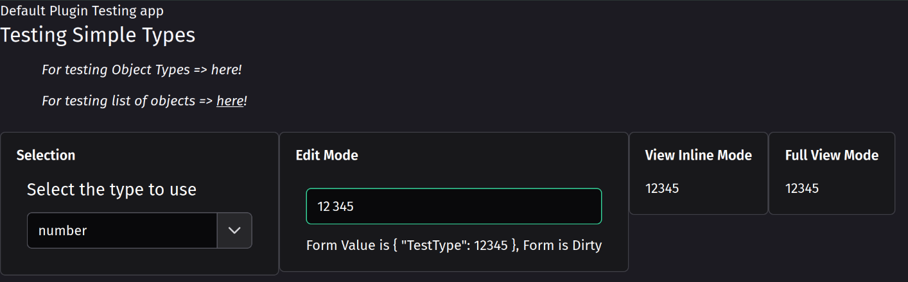
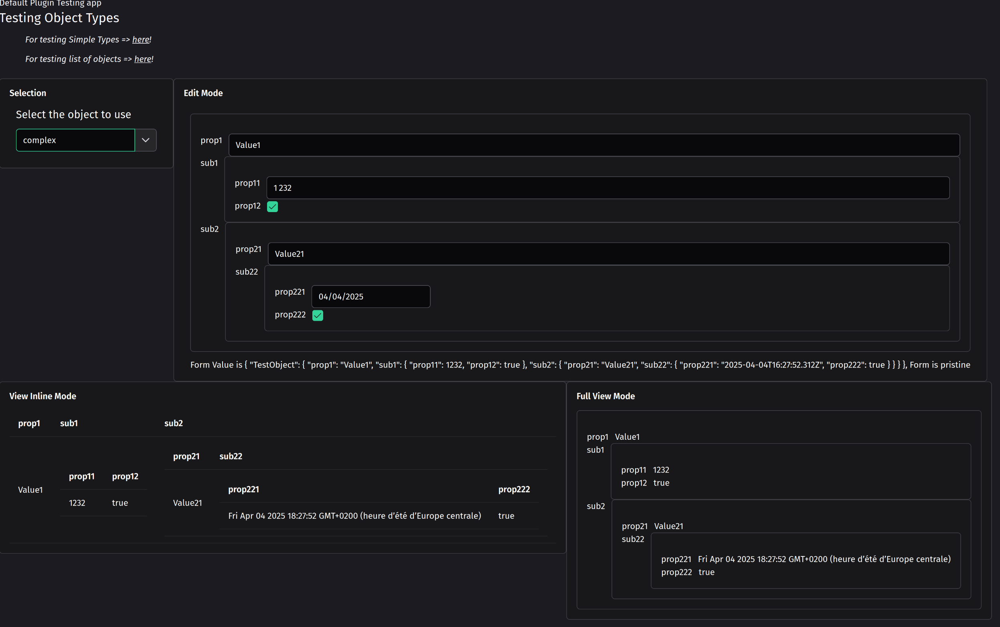
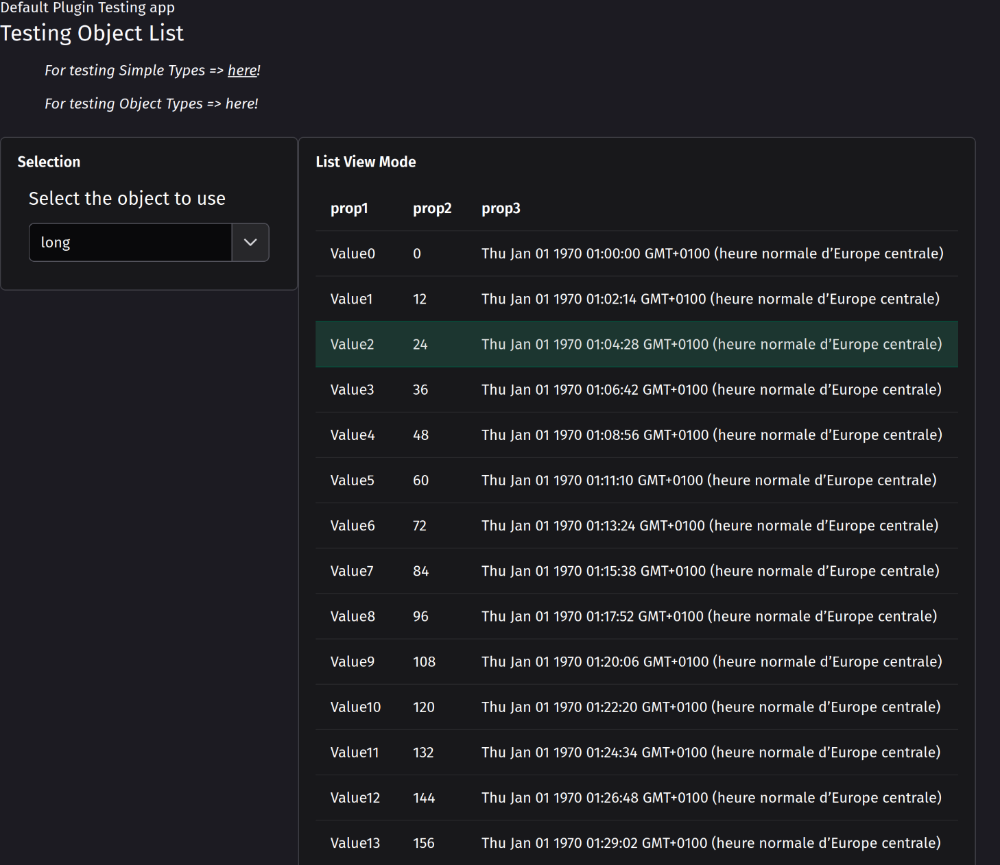

# Plugin xt-default

This plugin enable [xt-components](https://github.com/dont-code/ng-xtend/tree/main/libs/xt-components) to

- Display and edit any primitive value

- or complex object

- or list of objects

With it you are sure you can display / edit any type within any xt-components application like [xt-host](https://github.com/dont-code/ng-xtend/tree/main/libs/xt-host).

